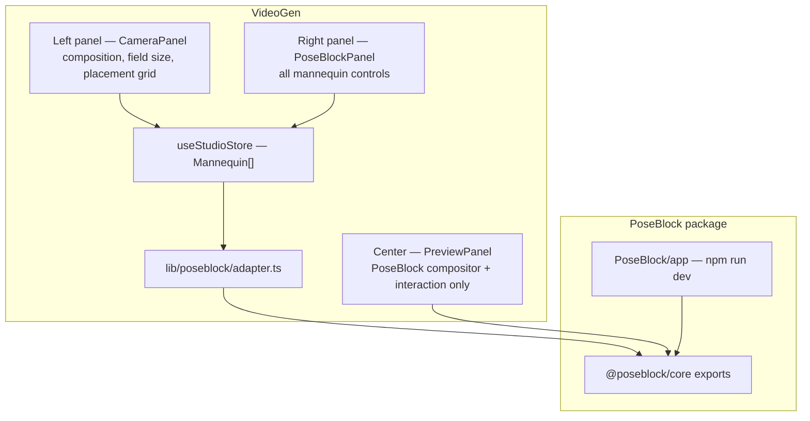

# PoseBlock ↔ VideoGen Integration Spec

Last updated: 2026-06-23

This document is the canonical plan for embedding PoseBlock into VideoGen while keeping PoseBlock runnable as a standalone app in its own git repo.

Related: [`TASKS.md`](TASKS.md) (feature backlog), [`README.md`](README.md) (PoseBlock architecture), VideoGen [`MANNEQUIN-PR-TRACKER.md`](../MANNEQUIN-PR-TRACKER.md) (PNG mannequin stack status).

---

## Goals

### Dual condition

PoseBlock must satisfy both of these at once:

1. **Git submodule of VideoGen** — checked out at `videogen/PoseBlock/`, versioned in its own remote, consumable by VideoGen as a local package.
2. **Standalone app** — `cd PoseBlock && npm run dev` runs a self-contained Next.js app with no VideoGen dependency for day-to-day PoseBlock development.

### Functional outcome

- VideoGen replaces its **static PNG mannequin** compositor with PoseBlock's **3D Mixamo compositor** for blocking workflows (Auto-place, Lock Start Frame).
- The center preview shows the composited frame (2D backdrop + transparent WebGL overlay). **All mannequin editing controls live in VideoGen's right panel** — not in canvas overlays, not in Leva, not in the left camera panel.
- VideoGen's existing `Mannequin[]` persistence shape remains the source of truth; PoseBlock renders from it via an adapter.

---

## Current state

| Area | PoseBlock | VideoGen |
|------|-----------|----------|
| Repo wiring | Nested clone with own `.git`; **not** a VideoGen submodule yet | No imports or `.gitmodules` entry for PoseBlock |
| Compositor | `PreviewFrame` + `Scene` — 2D img + transparent R3F canvas | `MannequinPlacementLayer` — PNG `` overlays on preview |
| Characters | Single GLB instance (`modelUrl`, world-space drag) | Multiple `Mannequin[]` with feet-anchor `x`/`y`/`scale` |
| Controls | `Toolbar`, `PoseAdjustToolbar`, Leva backdrop — overlaid on preview | Floating `mannequin-inspector-panel` on preview + field size in left `CameraPanel` |
| Coordinates | World units (`characterX/Y/Z`, `characterScale`) | Normalized feet anchor (see `lib/studio/mannequin-bounds-contract.ts`) |
| Export | `exportComposite.ts` → PNG download | `bake-start-frame.ts` canvas composite → bake / inpaint pipeline |
| Stack | Next 16, React 19, R3F v9, drei v10, Zustand 5 | Same (compatible) |

---

## Target architecture



### Package boundary

PoseBlock splits into:

```
PoseBlock/
  package.json          # name: "@poseblock/core" or "poseblock"
  src/                  # or keep flat — exportable modules
    components/
      PreviewFrame.tsx
      Scene.tsx
      CharacterManipulator.tsx
      PoseBlockCompositor.tsx   # NEW — embeddable root
    lib/
      store.ts                  # internal runtime store (optional in embed mode)
      exportComposite.ts
      framing/                  # NEW — anchor ↔ world adapter
  app/                  # standalone shell only
    page.tsx
    layout.tsx
  INTEGRATION.md
```

**Rules:**

- `@poseblock/core` must not import from `@/` VideoGen paths.
- VideoGen imports PoseBlock via `"poseblock": "file:./PoseBlock"` (or npm workspace).
- Standalone app wraps the same `PoseBlockCompositor` + local control panels that mirror the VideoGen right-panel UI (for dev parity).

---

## VideoGen UI layout

VideoGen studio shell (`components/studio/StudioShell.tsx`):

| Region | Width | Today | After integration |
|--------|-------|-------|-------------------|
| Left aside | `w-72` | `CameraPanel` — camera, workflow, composition, field size, placement grid | **Unchanged** — shot/camera/composition only |
| Center | `flex-1` | `PreviewPanel` + PNG `MannequinPlacementLayer` | `PoseBlockCompositor` + minimal on-canvas gizmos (drag handles, selection rings, character-assignment anchors) |
| Right aside | `w-72` | `LightingPanel` — theme transformer, lighting | **`PoseBlockPanel`** (new) — **all mannequin controls**; lighting sections move below or into a tab when blocking is active |

### Right panel: `PoseBlockPanel`

New component: `components/studio/PoseBlockPanel.tsx`, mounted in the right aside (replacing or stacking above `LightingPanel` depending on workflow).

**Everything below moves here from the preview overlay and PoseBlock standalone chrome:**

| Section | Controls | Source today |
|---------|----------|--------------|
| Mannequin list | Add, remove, reorder; click to select; Shift+click multi-select | `MannequinPlacementLayer` inspector — Add button |
| Selection summary | Count, "Clear selection" | New |
| Character | GLB model picker (xbot, ybot, teen_f, …) | PoseBlock `Toolbar` |
| Demographics | Gender, age (maps to GLB / scale) | Overlay inspector selects |
| Base pose | Preset picker (`a_pose`, `pointing_right`, …) | PoseBlock `Toolbar` |
| Pose adjust | Body-part picker, joint gizmo mode, undo/redo/reset | `PoseAdjustToolbar`, `PoseBodyPicker`, `PosePartControls` |
| Transform | Position X/Y, scale, rotation Y, depth Z; numeric fields use VideoGen anchor convention | Overlay bounds fields + world drag |
| Bounds framing | inset L/R/T/B, width÷frame height (when inspector bounds mode is active) | Overlay inspector numeric fields |
| Facing | Rotate mannequin Y (replaces PNG angle stepping where 3D rotation applies) | Overlay face ←/→ buttons |
| Character assignment | Subject slot dropdown (Lock Start Frame / bake workflows) | Overlay inspector |
| Interaction mode | Transform vs pose | PoseBlock store `interactionMode` |

**Center preview retains only:**

- Backdrop image (from shot reference / uploaded frame)
- 3D mannequin render
- Drag-to-move, corner scale, tilt handle, bounding box gizmo
- Character-assignment connector anchors (for `CharacterAssignmentConnector`)
- Selection highlight rings
- Empty-state hint ("Add a mannequin in the panel →")

**Remove from center after integration:**

- `mannequin-inspector-panel` floating card
- PoseBlock `Toolbar` overlay
- Leva panel (standalone dev uses right-panel-style layout instead)

### Mobile

On `lg:hidden`, mannequin controls appear in the bottom drawer (`StudioShell` mobile drawer) in a dedicated **Mannequins** section above or below lighting — same `PoseBlockPanel` component, not a separate implementation.

---

## State and persistence

### Source of truth

VideoGen `shot.mannequins: Mannequin[]` in `useStudioStore` remains authoritative for save/load, migration, and bake.

```typescript
// lib/types/studio.ts — unchanged storage shape
interface Mannequin {
  id: string;
  angle: MannequinAngle;
  gender: MannequinGender;
  age: MannequinAge;
  pose: MannequinPose;
  x: number;        // feet anchor, 0–1
  y: number;        // feet anchor, 0–1, >1 below frame
  scale: number;    // visual height multiplier
  rotation: number;
  subjectSlotIndex?: number;
  opacity?: number;
}
```

### Extended runtime fields (PoseBlock-only, not persisted initially)

Store PoseBlock-specific data in a parallel map or extended type until migration is defined:

```typescript
interface PoseBlockMannequinRuntime {
  modelUrl: string;
  basePoseId: string;
  poseAdjustments: PoseOp[];
  characterRotationX: number;
  characterRotationY: number;
  characterZ: number;
}
```

Persist pose adjustments and 3D-specific fields in a follow-up migration once the PNG → 3D cutover is stable.

### Sync flow

1. **Load shot** — `Mannequin[]` → adapter → PoseBlock instance list + world transforms.
2. **Edit in right panel or drag on canvas** — PoseBlock updates → adapter → `updateMannequin(id, patch)`.
3. **Add/remove** — `addMannequin()` / `removeMannequin()` in store; PoseBlock subscribes.
4. **Field size / placement grid change (left panel)** — triggers `syncMannequinsFromShot` (existing); adapter re-projects all instances.

---

## Coordinate adapter

VideoGen uses **normalized feet-anchor** storage. PoseBlock uses **orthographic world units** with `VIEW_HEIGHT = 4`.

New shared module: `PoseBlock/lib/framing/` (exported) + thin wrapper `videogen/lib/poseblock/adapter.ts`.

### VideoGen contract (reference)

From `lib/studio/mannequin-bounds-contract.ts`:

- **x**: 0 = left, 1 = right — feet center on silhouette
- **y**: 0 = top, 1 = frame bottom, >1 = feet below frame (CU/ECU)
- **scale**: visual height multiplier at `MANNEQUIN_BASE_HEIGHT_RATIO` (0.55)

Convert with existing helpers:

- `anchorToBoundsFrame` / `boundsFrameToAnchor` — `lib/studio/mannequin-bounds-framing.ts`
- `mannequinDrawLayout` — `lib/studio/mannequin-layout.ts`

### Adapter API (proposed)

```typescript
// PoseBlock/lib/framing/anchorAdapter.ts

export function anchorToWorldTransform(input: {
  mannequin: Pick<Mannequin, 'x' | 'y' | 'scale' | 'rotation'>;
  frameWidth: number;
  frameHeight: number;
  aspectRatio: AspectRatio;
  placementX?: number;
}): { x: number; y: number; scale: number; rotationY: number };

export function worldTransformToAnchor(input: {
  x: number;
  y: number;
  scale: number;
  rotationY: number;
  frameWidth: number;
  frameHeight: number;
  aspectRatio: AspectRatio;
  placementX?: number;
}): Pick<Mannequin, 'x' | 'y' | 'scale' | 'rotation'>;
```

### Mapping notes

- PoseBlock ortho scene width = `VIEW_HEIGHT * aspect`; height = `VIEW_HEIGHT`.
- Feet placement: VideoGen `y` anchor maps to PoseBlock group Y with the same semantic "feet on floor line" as PNG bake (`mannequinDrawLayout` offset math is the reference implementation).
- PoseBlock `characterZ` / depth scale coupling (`lib/characterTransform.ts`) is a **display-only** extension; adapter writes back `scale` as effective visual height after depth factor.
- PNG `MannequinAngle` (eight facings) maps to `characterRotationY` in 45° steps until per-angle GLB assets exist.

---

## Export and bake integration

| Path | Today | Target |
|------|-------|--------|
| Standalone | `ExportButton` → download PNG | Keep |
| VideoGen Lock Start Frame | `renderBakeFrames` draws PNG mannequins on canvas | Call PoseBlock `exportComposite` at native resolution → feed existing bake API |
| VideoGen Auto-place | Blocking prompt from mannequin positions | Unchanged — still reads `Mannequin x/y/scale` from store |

Replace PNG drawing in `lib/studio/bake-start-frame.ts` with PoseBlock composite output once parity is verified (`MANNEQUIN_BOUNDS` bake tests in `mannequin-bounds-bake-parity.test.ts` must pass against 3D export).

---

## Git submodule setup

PoseBlock is today a nested repo at `videogen/PoseBlock/`. Target:

```bash
# From VideoGen root (one-time migration)
git rm -r --cached PoseBlock   # if tracked as plain files
git submodule add <poseblock-remote-url> PoseBlock
git submodule update --init --recursive
```

Add to VideoGen `README.md`:

```bash
git clone --recurse-submodules <videogen-url>
# or after clone:
git submodule update --init --recursive
```

PoseBlock retains its own remote, CI, and `npm run dev`. VideoGen pins submodule SHA in commits.

---

## Phases and tasks

### Phase 0 — Documentation and repo wiring

- [x] **0.1** Create PoseBlock remote repo (if not already published)
- [x] **0.2** Register PoseBlock as VideoGen git submodule at `PoseBlock/`
- [x] **0.3** Add `poseblock` dependency to VideoGen `package.json` (`file:./PoseBlock`)
- [x] **0.4** Document clone/submodule steps in both READMEs
- [x] **0.5** Align `three` version across packages (VideoGen `^0.170`, PoseBlock `^0.175` — pick one)

### Phase 1 — Package export boundary

- [x] **1.1** Add `exports` field to PoseBlock `package.json` (compositor, framing, export)
- [x] **1.2** Create `PoseBlockCompositor` — props: `backdropUrl`, `frameWidth`, `frameHeight`, `instances`, `selectedIds`, callbacks (`onInstanceChange`, `onSelect`, …)
- [x] **1.3** Ensure compositor has zero VideoGen imports; accept all config via props
- [x] **1.4** Refactor standalone `app/page.tsx` to render compositor + local dev panel (mirrors VideoGen right panel layout)
- [x] **1.5** Remove Leva from standalone default UI (keep optional dev flag if needed)

### Phase 2 — PoseBlock feature gaps (blockers)

These must work in standalone PoseBlock before VideoGen embed.

#### Multiple mannequins

- [ ] **2.1** Replace single `modelUrl` / `characterX/Y/Z` with `instances: CharacterInstance[]` in store
- [ ] **2.2** Each instance: `id`, `modelUrl`, transform, pose state, `selected`
- [ ] **2.3** Scene renders one `CharacterManipulator` (or equivalent) per instance
- [ ] **2.4** Add mannequin — append instance with defaults; enforce max count (5 principal / 10 crowd — match VideoGen)
- [ ] **2.5** Remove mannequin — delete instance; clear from selection
- [ ] **2.6** Selection model: click instance to select; **Shift+click** toggles multi-select
- [ ] **2.7** Multi-select editing: right-panel changes apply to all selected instances (character model, pose preset); transform edits apply to primary selection only
- [ ] **2.8** Export composite renders all instances

#### VideoGen coordinate convention

- [ ] **2.9** Implement `anchorToWorldTransform` / `worldTransformToAnchor` in `PoseBlock/lib/framing/`
- [ ] **2.10** Drag on canvas updates feet-anchor `x/y/scale` through adapter (not raw world coords in persisted state)
- [ ] **2.11** Numeric fields in panel display VideoGen convention (percentages / anchor values)
- [ ] **2.12** Support `y > 1` (CU/ECU feet below frame) and scale-aware `maxFeetAnchorY`
- [ ] **2.13** Bounds inspector fields (`insetLeft/Right/Top/Bottom`, `widthToFrameHeight`) sync through `anchorToBoundsFrame` / `boundsFrameToAnchor` logic (port or shared package)
- [ ] **2.14** Unit tests: anchor ↔ world round-trip at 16:9, 9:16, and ECU scale extremes

### Phase 3 — VideoGen right panel

- [ ] **3.1** Create `components/studio/PoseBlockPanel.tsx` — full mannequin control surface
- [ ] **3.2** Mount in right aside in `StudioShell.tsx` (workflow-gated: visible when mannequins / blocking workflows are active)
- [ ] **3.3** Wire panel to `useStudioStore` mannequin actions (`addMannequin`, `updateMannequin`, `removeMannequin`, `assignMannequinSubjectSlot`)
- [ ] **3.4** Port overlay inspector fields from `MannequinPlacementLayer` into `PoseBlockPanel` (gender, age, pose, bounds, character assignment)
- [ ] **3.5** Port PoseBlock pose-editing UI (`PoseAdjustToolbar`, `PoseBodyPicker`, `PosePartControls`) into panel sections
- [ ] **3.6** Remove `mannequin-inspector-panel` from `MannequinPlacementLayer` (or retire layer entirely)
- [ ] **3.7** Mobile drawer: add Mannequins section using same `PoseBlockPanel`
- [ ] **3.8** Match VideoGen styling — `control-panel`, `InspectorField`, `RangeSlider`, `VisualDropdown` patterns from existing panels

### Phase 4 — VideoGen compositor embed

- [ ] **4.1** Embed `PoseBlockCompositor` in `PreviewPanel` for blocking workflows
- [ ] **4.2** Implement `lib/poseblock/adapter.ts` — store ↔ PoseBlock props
- [ ] **4.3** Subscribe compositor to `shot.mannequins` and `project.aspectRatio`
- [ ] **4.4** Keep character-assignment connector anchors on selected principal mannequins
- [ ] **4.5** Preserve click-to-place from composition grid (left panel) — maps to new instance at clicked anchor
- [ ] **4.6** Integrate `syncMannequinsFromShot` — layout changes re-project instances through adapter
- [ ] **4.7** Feature flag or workflow gate to fall back to PNG layer during rollout (`POSEBLOCK_COMPOSITOR=1`)

### Phase 5 — PNG migration and bake parity

- [ ] **5.1** Map `MannequinGender` / `MannequinAge` / `MannequinPose` to GLB + Mixamo preset IDs
- [ ] **5.2** Map `MannequinAngle` to `characterRotationY` (interim until per-facing GLB assets)
- [ ] **5.3** Replace PNG draw path in `bake-start-frame.ts` with PoseBlock export
- [ ] **5.4** Run / extend `mannequin-bounds-bake-parity.test.ts` for 3D export
- [ ] **5.5** Retire PNG overlay in `MannequinPlacementLayer` once parity verified
- [ ] **5.6** Deprecate `public/stock/mannequins/` usage in blocking workflows (keep assets until cutover complete)
- [ ] **5.7** Update `buildMannequinBlockingPrompt()` to reflect 3D poses where relevant

### Phase 6 — Persistence and polish

- [ ] **6.1** Define migration for `poseAdjustments` and 3D fields on `Mannequin` (or sidecar on `ShotWorkflowState`)
- [ ] **6.2** Persist selected PoseBlock model URL per mannequin
- [ ] **6.3** Undo/redo pose adjustments (per instance) — optional sync to VideoGen history
- [ ] **6.4** Update `MANNEQUIN-PR-TRACKER.md` — add PoseBlock integration stack
- [ ] **6.5** Update PoseBlock `README.md` — integration section points here

---

## Workflow gating

| VideoGen workflow | Compositor | Right panel |
|-------------------|------------|-------------|
| Auto-place | PoseBlock 3D | PoseBlockPanel |
| Lock Start Frame | PoseBlock 3D | PoseBlockPanel + character assignment |
| Other workflows | PNG fallback until Phase 5 complete | Existing UI |

---

## Demographic and pose mapping (initial)

| VideoGen field | PoseBlock equivalent (Phase 5) |
|----------------|--------------------------------|
| `gender: male` | `xbot` or `ybot` GLB |
| `gender: female` | `teen_f` GLB (or future female model) |
| `age: adult/teen/child` | scale modifier + model selection |
| `pose: standard` | `a_pose` or `t_pose` |
| `pose: walking` | `walking` |
| `pose: seated` | TBD preset |
| `angle: front/threeQuarterLeft/…` | `characterRotationY` in 45° steps |

Expand mapping table as new GLB assets and presets are authored.

---

## Future features (not blocking integration)

From [`TASKS.md`](TASKS.md) — remain in PoseBlock repo:

1. **Pose from reference image** — ControlNet / OpenPose → Mixamo; save pose to DB
2. **Automatic vanishing point / plane detection** — J-Linkage, 1D Hough, row-space clustering
3. **SAM 3D Body pipeline** — already scripted; produces rigged GLB assets

These should be developed against standalone PoseBlock; VideoGen benefits automatically via submodule updates.

---

## Acceptance criteria

| # | Check |
|---|-------|
| 1 | `git submodule update --init` yields working PoseBlock inside VideoGen |
| 2 | `cd PoseBlock && npm run dev` runs with no VideoGen dependency |
| 3 | VideoGen blocking workflow shows 3D compositor in center preview |
| 4 | **All** mannequin editing controls appear in the **right panel** only — no floating inspector on preview |
| 5 | Multiple mannequins: add, remove, select, Shift+multi-select |
| 6 | Drag and numeric fields persist as VideoGen feet-anchor `x`/`y`/`scale` |
| 7 | Field size / placement grid changes re-layout mannequins correctly |
| 8 | Lock Start Frame bake produces equivalent framing to PNG path (parity tests pass) |
| 9 | Character assignment connector works with 3D mannequin anchors |
| 10 | Mobile drawer exposes the same mannequin controls |

---

## Key files reference

### PoseBlock (implement)

| File | Role |
|------|------|
| `components/PoseBlockCompositor.tsx` | Embeddable root |
| `components/PreviewFrame.tsx` | 2D backdrop layer |
| `components/Scene.tsx` | R3F transparent overlay |
| `components/CharacterManipulator.tsx` | Per-instance 3D character |
| `lib/framing/anchorAdapter.ts` | Coordinate conversion |
| `lib/exportComposite.ts` | Full-res PNG export |
| `lib/store.ts` | Internal state (multi-instance) |

### VideoGen (integrate)

| File | Role |
|------|------|
| `components/studio/StudioShell.tsx` | Mount right-panel `PoseBlockPanel` |
| `components/studio/PoseBlockPanel.tsx` | **New** — all mannequin controls |
| `components/studio/PreviewPanel.tsx` | Embed compositor |
| `lib/poseblock/adapter.ts` | Store ↔ PoseBlock bridge |
| `lib/types/studio.ts` | `Mannequin` type (source of truth) |
| `lib/studio/mannequin-bounds-framing.ts` | Bounds ↔ anchor math |
| `lib/studio/mannequin-sync.ts` | Layout sync on composition changes |
| `lib/studio/bake-start-frame.ts` | Bake export (Phase 5) |
| `store/useStudioStore.ts` | Mannequin CRUD |

---

## Recommended execution order

1. Phase 0 — submodule + package wiring
2. Phase 1 — export boundary + `PoseBlockCompositor`
3. Phase 2 — multi-mannequin + anchor adapter (standalone)
4. Phase 3 — VideoGen right panel (can stub with read-only fields early)
5. Phase 4 — compositor embed + store sync
6. Phase 5 — bake parity + PNG retirement
7. Phase 6 — persistence migration + docs

Phases 3 and 4 can overlap once Phase 2.1–2.6 land; Phase 5 waits on export parity.
