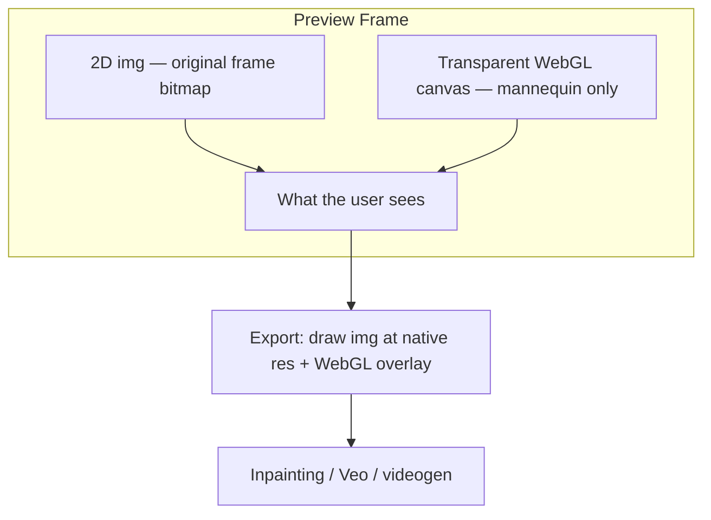

# PoseBlock — Project Plan (Current State)

## Goal

Standalone Next.js app for **pose blocking**: load a video frame, position and pose a Mixamo-rigged 3D mannequin on top, built for exporting a full-resolution PNG for inpainting / AI video tools.

**In scope:** frame upload, drag-to-position mannequin, pose picker, composite export.

**Out of scope (v1):** video generation, prompts, in-app SAM inference, multiple characters, finger pose editor, automatic
vanishing point detection.

Later this folds into **videogen** — same component boundaries and Zustand state shape.

---

## Architecture

PoseBlock is a **compositor**, not a single 3D scene with a textured backdrop plane.



**Why not a 3D backdrop plane?** A photo mapped to a plane and viewed with perspective loses resolution (GPU resampling) and warps the image. For inpainting the background must stay pixel-perfect and undistorted.

| Layer | Technology | Role |
|-------|------------|------|
| Background | `` in `PreviewFrame` | Exact video frame, no 3D |
| Foreground | Three.js via R3F, `alpha: true` | Mannequin only |
| Export | 2D canvas composite | Source image + WebGL at native resolution |

---

## Tech Stack

| Package | Version | Notes |
|---------|---------|-------|
| Next.js | 14.x App Router | Pinned with React 18 for R3F v8 compatibility |
| React | 18.x | |
| @react-three/fiber | ^8.15 | Canvas overlay |
| @react-three/drei | ^9.92 | `useGLTF`, `OrthographicCamera` |
| three | ^0.160 | |
| leva | ^0.9 | Dev controls panel |
| zustand | ^4.5 | App state |
| three-stdlib | (via drei) | `SkeletonUtils.clone` for skinned meshes |

R3F is used for the mannequin overlay only. The backdrop is plain HTML. Upgrading to Next 15 requires R3F v9 + React 19 together.

---

## File Structure

```
app/
  layout.tsx
  page.tsx                 # Preview frame, upload UI, error overlay
  globals.css
components/
  PreviewFrame.tsx         # 2D  + canvas stack, aspect from image
  Scene.tsx                # Transparent R3F canvas, orthographic camera
  Character.tsx            # GLB load, skeleton, pose apply, drag group
  DragPlane.tsx            # Invisible plane for pointer drag positioning
  ExportRegistrar.tsx        # Registers full-res composite export handler
  Controls.tsx               # Leva: character, pose, scale, position, backdrop
  ExportButton.tsx           # Triggers composite export + download
lib/
  store.ts                   # Zustand state
  poses.ts                   # 10 Mixamo poses (with fingers), lerpPose, bone helpers
  exportComposite.ts         # loadImage, compositeToDataURL, export handler registry
public/
  default_backdrop.jpg       # Stock frame (building entrance HDR photo)
  models/
    xbot_mixamo.glb          # Mixamo X-Bot (Three.js sample) — default
    ybot_mixamo.glb          # Placeholder copy until real Y-Bot from Mixamo
    teen_f_mixamo.glb        # Placeholder until SAM + Blender retarget
scripts/
  generate_character.py      # HF Space client for SAM 3D Body
  requirements.txt
  verify_setup.sh
  blender/
    retarget_mhr_to_mixamo.py
    bone_map_mhr_mixamo.json
docs/
  CHARACTER-PIPELINE.md      # SAM → Blender → Mixamo workflow
  VEO-TEST.md                # Manual validation checklist
```

---

## Components

### `PreviewFrame.tsx`
- Renders backdrop as ``.
- On `onLoad`, stores `frameWidth` / `frameHeight` from `naturalWidth` / `naturalHeight`.
- Preview container uses `aspect-ratio` from those dimensions.
- Children (transparent Canvas) fill the same box.

### `Scene.tsx`
- R3F `Canvas` with `alpha: true`, `preserveDrawingBuffer: true`, clear color `(0,0,0,0)`.
- **Orthographic camera** (not perspective) — no FOV warp on export.
- `VIEW_HEIGHT = 4` world units; bounds update on resize.
- No backdrop mesh, no OrbitControls.

### `Character.tsx`
- Loads GLB via `useGLTF`.
- Clones with `SkeletonUtils.clone()` (plain `scene.clone()` breaks skinning).
- Finds skeleton from `SkinnedMesh`; error if missing.
- Applies pose via `lerpPose(skeleton, POSES[currentPose], 1)` + `updateSkeleton()`.
- Bone lookup handles `mixamorig:` prefix (`getBone` in `poses.ts`).
- Group position/scale from store; model offset `scale=1.8`, `y=-0.9` for feet placement.
- `ModelErrorBoundary` for GLB load failures.

### `DragPlane.tsx`
- Invisible plane in front of character; pointer drag updates `characterX` / `characterY`.
- Window `pointerup` / `pointercancel` ends drag.

### `Controls.tsx` (Leva)
- `character` — xbot, ybot, teen_f
- `pose` — 10 poses from `POSES`
- `scale` — 0.3–2.5
- `positionX` / `positionY` — fine-tune (-3 to 3)
- `backdrop` — image picker

### `ExportButton.tsx` + `ExportRegistrar.tsx`
- Export resizes WebGL renderer to backdrop native resolution.
- Draws source `` then WebGL canvas onto 2D canvas.
- Downloads `pose_blocking.png`.
- Later: replace download with `generateVideo({ image_1: dataURL })` in videogen.

---

## State (`lib/store.ts`)

```typescript
modelUrl: '/models/xbot_mixamo.glb'
currentPose: 'pointing_right'
backdropUrl: '/default_backdrop.jpg'
frameWidth: 16          // updated on image load
frameHeight: 9
characterX: 0
characterY: 0
characterScale: 1
characterError: string | null
```

Removed from original plan: `fov`, `headroom` (were perspective-camera controls; replaced by drag + scale).

---

## Poses (`lib/poses.ts`)

10 Mixamo-compatible poses with finger control:

`a_pose`, `t_pose`, `pointing_right`, `pointing_left`, `hands_on_hips`, `arms_crossed`, `waving`, `thinking`, `walking`, `surprised`

- Quaternions `[x, y, z, w]` in local bone space.
- `lerpPose()` snaps poses (`alpha=1`); calls `updateSkeleton()` after bone updates.
- `MIXAMO_BONES` reference array included.
- Dev console warns on missing bones.

---

## Models

| ID | File | Status |
|----|------|--------|
| `xbot` | `public/models/xbot_mixamo.glb` | Mixamo X-Bot from Three.js examples (chrome mannequin) |
| `ybot` | `public/models/ybot_mixamo.glb` | Same mesh placeholder — replace with real Y-Bot from [mixamo.com](https://www.mixamo.com) |
| `teen_f` | `public/models/teen_f_mixamo.glb` | Placeholder — replace via SAM + Blender pipeline |

All use standard Mixamo skeleton (`mixamorig:Hips`, `mixamorig:LeftArm`, etc.).

---

## Character Asset Pipeline

Documented in [`docs/CHARACTER-PIPELINE.md`](docs/CHARACTER-PIPELINE.md).

1. **Generate:** `python scripts/generate_character.py photo.jpg --name teen_f` (HuggingFace SAM 3D Body Spaces)
2. **Retarget:** `blender --background --python scripts/blender/retarget_mhr_to_mixamo.py -- ...`
3. **Output:** `public/models/teen_f_mixamo.glb`

Prerequisites: HF token, gated model access (`facebook/sam-3d-body-dinov3`), Blender 3.6+.

---

## Defaults

| Setting | Value |
|---------|-------|
| Character | X-Bot (`xbot_mixamo.glb`) |
| Pose | `pointing_right` |
| Backdrop | `public/default_backdrop.jpg` (HDR building entrance photo) |
| Position | `(0, 0)` |
| Scale | `1` |

---

## Run

```bash
npm install
npm run dev        # http://localhost:3000
npm run build
./scripts/verify_setup.sh
```

Upload a frame via **Upload frame** or Leva. Drag to position. **Export for inpainting** downloads the composite PNG.

---

## Acceptance Criteria

| # | Check | Status |
|---|-------|--------|
| 1 | Load character, select pose, backdrop loads in preview frame | Done |
| 2 | Drag (or sliders) repositions mannequin in frame in real time | Done |
| 3 | Export PNG: undistorted backdrop at native resolution + mannequin overlay | Done |
| 4 | Real `teen_f_mixamo.glb` from SAM pipeline loads and poses correctly | Pending user pipeline run |
| 5 | Veo / inpainting model maps character from exported PNG | Manual — see [`docs/VEO-TEST.md`](docs/VEO-TEST.md) |

---

## Known Limitations

- `ybot` and `teen_f` are placeholder copies of X-Bot until real assets are added.
- Drag sets group origin to click point (no grab-offset yet).
- Single mannequin only.
- Pose transitions snap instantly (no `useFrame` lerp animation).
- Next.js 14 shows "outdated" warning; upgrade blocked on R3F v8 / React 18 pairing.
- SAM pipeline script depends on HF Space availability; manual fallback documented.

---

## Videogen Integration (Future)

Copy `PreviewFrame`, `Scene`, `Character`, `Controls` (or replace Leva with existing UI). Keep Zustand state shape. Swap `ExportButton` download for `generateVideo({ image_1: dataURL })`.

---

## Milestones (Completed)

1. Scaffold Next.js + R3F + export
2. Load Mixamo GLB with skeleton detection + error states
3. Apply 10 finger poses from `lib/poses.ts`
4. Leva controls + backdrop upload
5. SAM pipeline scripts + Blender retarget script + docs
6. **Compositor refactor:** 2D backdrop, transparent overlay, ortho camera, drag positioning, full-res composite export
